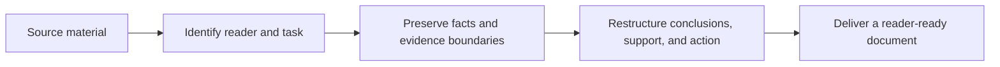

# Reader's Seat

> Help AI write from the reader's position, so work documents are easier to understand, judge, and act on.

[中文说明](README.md) · [Examples](examples/quick-start.md)

[](SKILL.md)
[](LICENSE)
[](https://github.com/BobbyYue/reader-seat/actions/workflows/validate.yml)

Reader's Seat is for substantive work documents built from supplied material or reliable sources. It helps readers find the practical conclusion, trace judgments to evidence, distinguish observation from causality, and understand whether action is required.

It is a reader-first AI writing skill for Codex and other agent hosts. It covers news briefs, technical proposals, product documents, business updates, data analysis reports, and SOPs.

## How It Works



It does not force every document into one template. It routes the task by what the reader needs to do.

## Good Fits

- news and industry briefs;
- technical proposals and architecture reviews;
- product introductions, launch notes, and PRDs;
- business updates, retrospectives, and performance summaries;
- data analysis and research reports;
- SOPs, runbooks, and help articles.

It is not intended for short chat-message polishing, unsupported content expansion, or visual styling without a document task.

## Install In Codex

```bash
git clone https://github.com/BobbyYue/reader-seat.git ~/.codex/skills/reader-seat
```

Then start a new Codex task and invoke it explicitly:

```text
Use $reader-seat to rewrite this analysis for a product leader.
Preserve the metrics, magnitude, time period, and uncertainty.
Separate observed facts, plausible explanations, causal claims, and unknowns.
Return Markdown.
```

Natural-language requests that clearly ask for a reader-first or reader-friendly work document may also trigger the skill automatically in supported hosts.

## What To Provide

```text
Material: the source text, data, or links
Reader: who will use the document and what they already know
Reader task: what they need to understand, judge, or do
Format: HTML, Feishu/Lark, Word, Markdown, plain text, or another target
```

If no output format is specified, a new finished document defaults to self-contained HTML. If no output language is specified, the result follows the dominant language of the source rather than the language of the prompt.

## What It Protects

- Facts, numbers, definitions, scope, ownership, commitments, and uncertainty.
- The distinction between observation, interpretation, causality, advice, and unknowns.
- Titles that provide supported information instead of manufactured suspense.
- Visuals that reduce a real reader cost rather than decorate the page.
- Native behavior when the user requests Feishu/Lark, Word, Markdown, or another non-HTML format.

Reader's Seat does not publish, overwrite, or send content without explicit authorization.

## Other Agent Hosts

Place the repository where the host can read it and explicitly load `SKILL.md`. Automatic discovery differs across hosts. See [Agent Portability And Stability](references/agent-portability.md) for deterministic module resolution, manual prompt bundles, headless adapters, and the cross-agent evaluation matrix.

The repository does not claim cross-agent stability until at least two named hosts pass the same frozen cases, with three repetitions per host and worst-case semantic judging.

## Validate

```bash
python3 scripts/validate_skill.py
```

Third-party font and visualization licenses are listed in [Third-Party Notices](assets/html/THIRD_PARTY_NOTICES.md).
