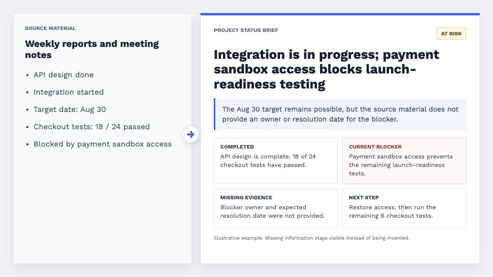

# Reader's Seat

> Turn scattered source material into complete documents readers can understand, verify, and act on.

[中文说明](README.zh-CN.md) · [Prompt examples](examples/quick-start.en.md) · [Install](#install)

[](SKILL.md)
[](LICENSE)
[](https://github.com/BobbyYue/reader-seat/actions/workflows/validate.yml)

Most AI drafts are fluent sentence by sentence but hard to judge as a whole: the conclusion is buried, evidence is disconnected, and the next step is unclear. Reader's Seat makes those parts visible while preserving the source facts and leaving missing information missing.



<sub>Illustrative project update. The finished document preserves the source facts and exposes what the material does not establish.</sub>

## Install

### Ask Your Agent

Send this instruction to an agent that can install skills:

```text
Install Reader's Seat from https://github.com/BobbyYue/reader-seat.
Use the skill installer supported by this agent, keep the folder name reader-seat,
then confirm that SKILL.md can be loaded. Do not overwrite an existing installation without asking.
```

### Clone Manually

Clone the repository into the skill directory used by your agent:

```bash
git clone https://github.com/BobbyYue/reader-seat.git /path/to/your-agent/skills/reader-seat
```

Then start a new agent session or ask the agent to load `reader-seat/SKILL.md` explicitly. Skill discovery differs between agents.

## What You Can Make

| Start with | Get a complete document |
| --- | --- |
| Weekly reports, milestones, meeting notes, issue lists | **Project status brief** with the current conclusion, progress, blockers, decisions, and next steps |
| Metric definitions, query results, charts, methodology notes | **Analysis report** with the finding and magnitude, supporting evidence, data limits, alternative explanations, and next validation |
| Requirements, constraints, candidate architectures, benchmarks | **Technical decision document** with the decision, option comparison, trade-offs, implementation impact, rollback, and unresolved risks |

It also supports news and industry briefs, product documents, retrospectives, performance summaries, SOPs, runbooks, and help articles.

## Use It

Name the material, reader, and job the document must do. For example:

```text
Use Reader's Seat to turn these weekly reports, milestone plan, meeting notes,
and issue list into a complete project status report for the leadership team.
Make the current conclusion, schedule risk, supporting evidence, decisions needed,
and next steps easy to find. Preserve unknowns instead of filling them in.
```

See [ready-to-use prompts](examples/quick-start.en.md) for project progress, data analysis, and technical route documents.

## What It Protects

- **Meaning:** facts, quantities, definitions, ownership, commitments, and uncertainty remain intact.
- **Judgment:** conclusions stay connected to evidence, scope, and credible alternatives.
- **Reader effort:** titles, structure, and visuals help the reader locate and compare information instead of creating decoration.
- **Output fit:** the default is self-contained HTML in the source material's dominant language, unless another format or language is requested.

Reader's Seat does not publish, overwrite, or send content without explicit authorization. It is intended for substantive documents rather than short-message polishing or unsupported content expansion.

<details>
<summary><strong>Repository structure, validation, and licenses</strong></summary>

| Folder | Function |
| --- | --- |
| `.github/` | Runs repository checks on every push and pull request. |
| `agents/` | Helps supported agent hosts recognize and present Reader's Seat. |
| `assets/` | Provides the self-contained HTML template, local fonts, and chart and diagram runtimes. |
| `config/` | Defines document scenarios, module-loading profiles, agent adapters, and the enforceable skill contract. |
| `evals/` | Provides frozen trigger, behavior, and cross-agent cases with judging criteria. |
| `examples/` | Contains prompts users can adapt to common document tasks. |
| `references/` | Provides detailed rules selected for each scenario, format, title, evidence, and visual need. |
| `scripts/` | Validates the skill, selects modules, creates HTML report scaffolds, and runs evaluations. |

Validate an installation:

```bash
python3 /path/to/reader-seat/scripts/validate_skill.py
```

Update an installation:

```bash
git -C /path/to/reader-seat pull
```

Third-party font and visualization licenses are listed in [Third-Party Notices](assets/html/THIRD_PARTY_NOTICES.md).

</details>
