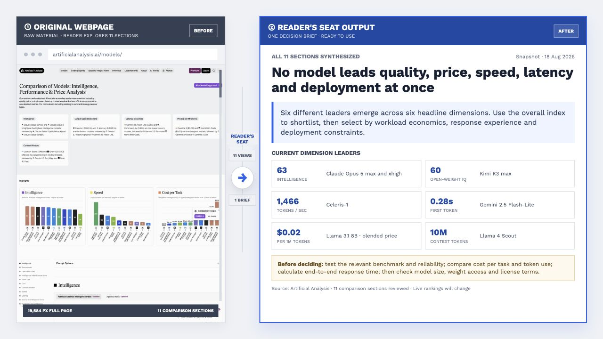

# Reader's Seat

> 把零散材料整理成读者容易理解、验证和行动的完整文档。

[English](README.md) · [提示词示例](examples/quick-start.md) · [安装](#安装)

[](SKILL.md)
[](LICENSE)
[](https://github.com/BobbyYue/reader-seat/actions/workflows/validate.yml)

信息很多不等于结论清楚。面对密集网页或长文档，读者往往仍要自己找重点、对证据、判断该怎么做。Reader's Seat 把材料整理成完整文档，让结论、证据、边界和下一步容易找到，同时不补写材料里没有的事实。

<p align="center"><strong>① 左侧是原始网页 → ② 右侧是 Reader's Seat 输出</strong></p>



<sub>左侧使用实时 [Artificial Analysis 模型对比页面](https://artificialanalysis.ai/models/)的真实连续长截图片段，右侧综合页面全部 11 个比较部分。预览为特定日期的快照，排名会继续变化。</sub>

## 安装

### 让 Agent 安装

把下面的指令发给能够安装 skill 的 Agent：

```text
从 https://github.com/BobbyYue/reader-seat 安装 Reader's Seat。
使用当前 Agent 支持的 skill 安装方式，文件夹名称保持为 reader-seat，
然后确认 SKILL.md 可以被加载。已有同名安装时不要直接覆盖，先询问我。
```

### 手动 Git Clone

把仓库克隆到当前 Agent 使用的 skill 目录：

```bash
git clone https://github.com/BobbyYue/reader-seat.git /path/to/your-agent/skills/reader-seat
```

然后新建一个 Agent 会话，或让 Agent 显式加载 `reader-seat/SKILL.md`。不同 Agent 的 skill 发现方式不同。

## 能生成哪些文档

| 你提供 | 得到的完整文档 |
| --- | --- |
| 周报、里程碑计划、会议记录、问题清单 | **项目进展报告**：当前结论、进度、阻塞、待决策事项和下一步 |
| 指标定义、查询结果、图表、方法说明 | **数据分析报告**：结论与幅度、支持证据、数据限制、其他解释和下一步验证 |
| 业务需求、技术约束、候选架构、性能测试 | **技术决策文档**：决策、方案比较、取舍、实施影响、回滚和未解决风险 |

它也适用于新闻和行业资料、产品文档、项目复盘、绩效总结、SOP、运行手册和帮助文档。

## 怎么使用

说明材料、读者和文档需要完成的任务。例如：

```text
使用 Reader's Seat，把这些周报、里程碑计划、会议记录和问题清单
整理成一份给管理层阅读的完整项目进展报告。
让当前结论、进度风险、支持证据、待决策事项和下一步容易找到；
材料里没有的信息保持未知，不要自行补全。
```

项目进展、数据分析和技术路线的完整写法见[提示词示例](examples/quick-start.md)。

## 它会守住什么

- **原意不变：**保留事实、数字、定义、负责人、承诺和不确定性。
- **判断有据：**结论能够对应到证据、适用范围和其他合理解释。
- **降低阅读成本：**标题、结构和视觉元素用于帮助定位和比较信息，而不是装饰。
- **输出符合场景：**默认使用原材料的主要语言生成自包含 HTML；用户指定时可以改为飞书、Word、Markdown 等格式。
- **交付边界明确：**生成前锁定语言、格式和发布权限；校验未通过或缺少回执时不交付。

未经明确授权，Reader's Seat 不会发布、覆盖或发送内容。它面向有实质材料的完整文档，而不是短消息润色或没有依据的内容扩写。

<details>
<summary><strong>仓库结构、校验和许可证</strong></summary>

| 文件夹 | 提供的功能 |
| --- | --- |
| `.github/` | 在每次代码推送和合并请求时自动检查仓库。 |
| `agents/` | 帮助支持的 Agent 识别并展示 Reader's Seat。 |
| `assets/` | 提供自包含 HTML 模板、本地字体以及图表和流程图运行时。 |
| `config/` | 定义文档场景、模块加载方式、Agent 适配设置和可校验的 skill 约束。 |
| `evals/` | 提供固定的触发、行为和跨 Agent 测试案例及评判标准。 |
| `examples/` | 提供可以直接改写使用的常见文档提示词。 |
| `references/` | 提供按场景、格式、标题、证据和视觉需要选择的详细规则。 |
| `scripts/` | 校验 skill、选择模块、创建 HTML 报告骨架并运行评测。 |
| `tests/` | 验证语言、格式、授权、来源完整性和交付回执约束。 |

校验安装：

```bash
python3 /path/to/reader-seat/scripts/validate_skill.py
```

更新安装：

```bash
git -C /path/to/reader-seat pull
```

第三方字体和可视化运行时的来源与许可证见 [Third-Party Notices](assets/html/THIRD_PARTY_NOTICES.md)。

</details>
